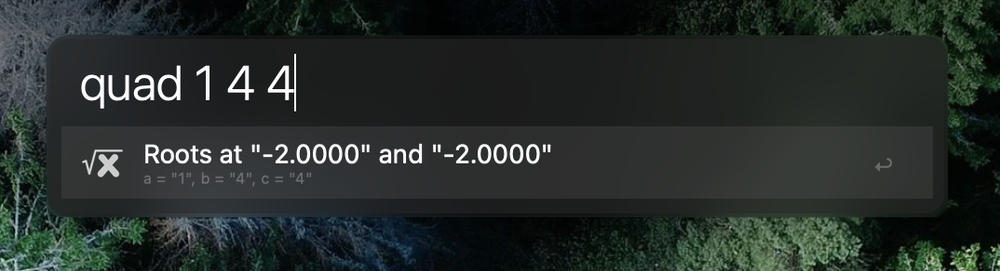

# ¿Qué es esto
- this is a repo to share my alfred workflows

# Quadratic
- whilst teaching, sometimes I need to quickly find the roots of a quadratic
- as such, I have taken one of my C programs from [here]() and configured alfred to return the roots

# Binary Conversion
- not regularly useful, but when you need it you need it
- this way I can also recycle some of my old code from when I was learning C

